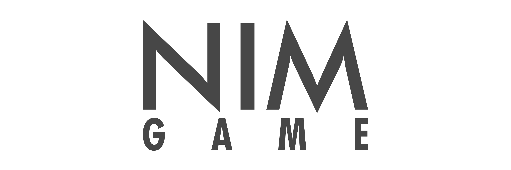

   

-----------------

# NIM GAME

No NIM Game, <bold>n</bold> peças são inicialmente dispostas numa mesa ou tabuleiro. Dois jogadores jogam alternadamente, retirando pelo menos 1 e no máximo <bold>m</bold> peças cada um. Quem tirar as últimas peças possíveis ganha o jogo.

Existe uma estratégia para ganhar o jogo que é muito simples: ela consiste em deixar sempre múltiplos de <bold>(m+1)</bold> peças ao jogador oponente.

'''Obs.: Nessa implementação o computador sempre vence.'''

Building using Python Programming Language

Author: [Wesley Mendes](https://github.com/WesGtoX)

## What is the Python? ##

Python is a programming language that lets you work quickly and integrate systems more effectively.

### License ###

[MIT](LICENSE)